## App List

### Welcome app
> /first_app

### Login Form
> /login_form

#### Screenshots
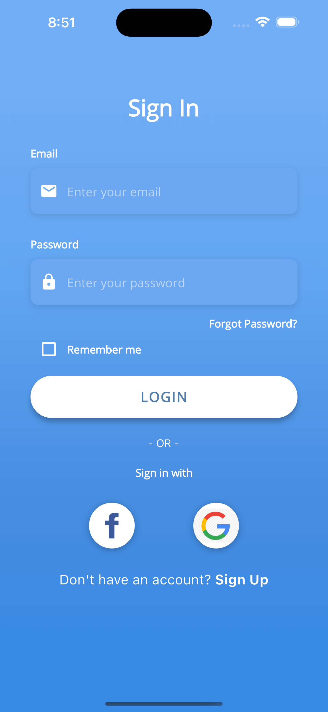

### Simple WhatsApp Clone
> /whatsapp

#### Screenshots
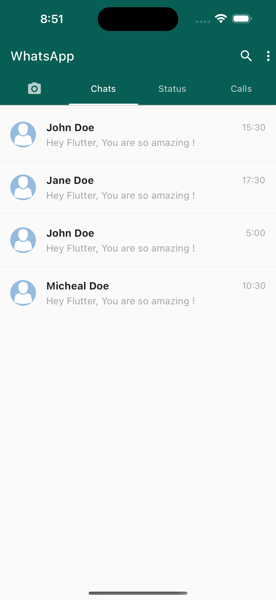

### Netflix Clone
> /netflix

#### Screenshots

    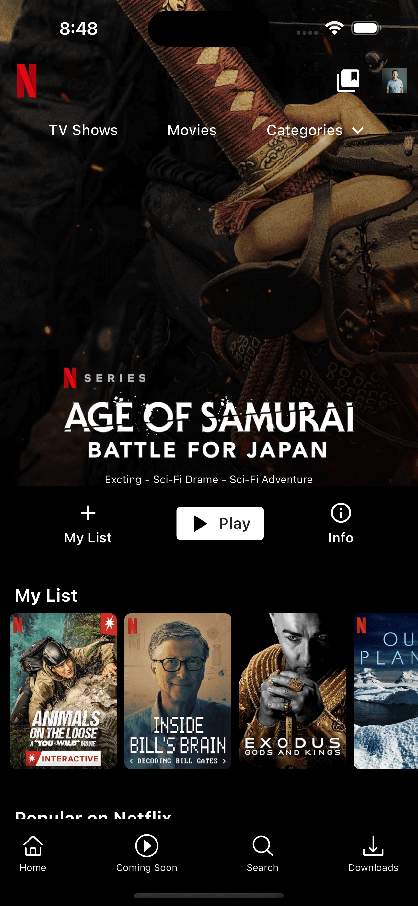
    
    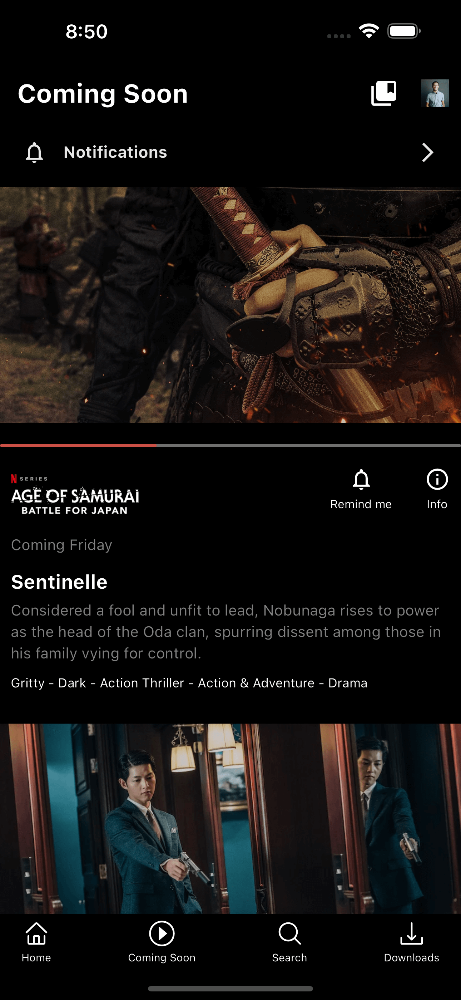
    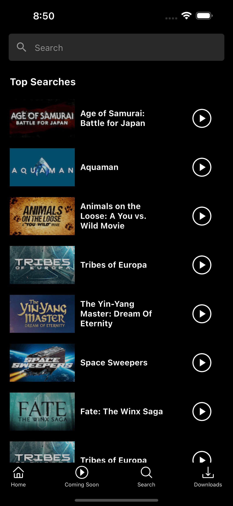
    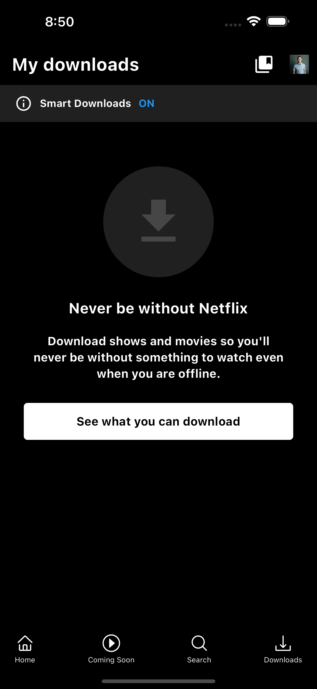

### Banking App
> /banking_app

#### Screenshots

    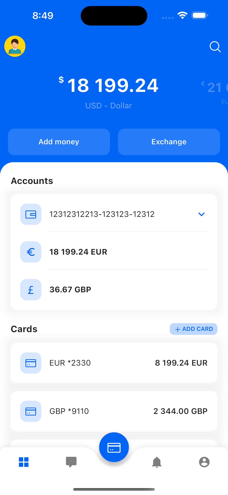
    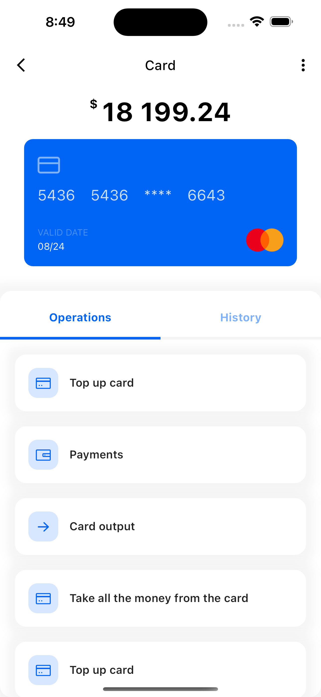

### Pet Adoption
> /pet_adoption

#### Screenshots

    
    

### Parallax Effect
> /parallax_effect

#### Screenshots

### Settings Screen
> /settings_screen

#### Screenshots

### Training App with Video Player
> /training_app_with_video_player

#### Screenshots

    
    
    
    
    

### Quiz App
[Learn Flutter and Dart to Build iOS and Android Apps - Second Edition](https://learning.oreilly.com/course/learn-flutter-and/9781805122029/)
> /first_app

#### Screenshots

    
    
    

### Expense Tracker
[Learn Flutter and Dart to Build iOS and Android Apps - Second Edition](https://learning.oreilly.com/course/learn-flutter-and/9781805122029/)
> /expense-tracker

#### Screenshots

    
    

### Meals App
[Learn Flutter and Dart to Build iOS and Android Apps - Second Edition](https://learning.oreilly.com/course/learn-flutter-and/9781805122029/)
> /meals_app

#### Screenshots

    
    
    
    
    
    

### Shopping List App
[Learn Flutter and Dart to Build iOS and Android Apps - Second Edition](https://learning.oreilly.com/course/learn-flutter-and/9781805122029/)
> /shopping_list_app

#### Screenshots

    
    
    
    
    

### Places App
[Learn Flutter and Dart to Build iOS and Android Apps - Second Edition](https://learning.oreilly.com/course/learn-flutter-and/9781805122029/)
> /places_app

#### Screenshots

    
    
    
    
    

### Chat App (Firebase Auth, FireStore, Firebase Storage, (Firebase Messaging, Firebase Cloud Function for Push Notification))
[Learn Flutter and Dart to Build iOS and Android Apps - Second Edition](https://learning.oreilly.com/course/learn-flutter-and/9781805122029/)
> /flutter_chat

#### Screenshots

    
    
    

### Blogs App (Authentication/Authorization, BLoC/Cubit, Hive, GetIt)
[Flutter Clean Architecture Full Course For Beginners - Bloc, Supabase, Hive, GetIt](https://www.youtube.com/watch?v=ELFORM9fmss)
> /blog_app

#### Screenshots

    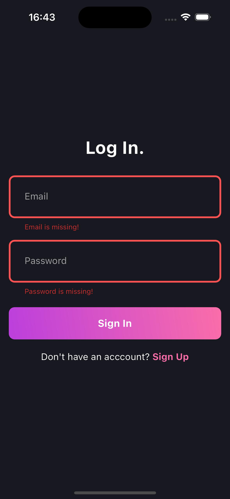
    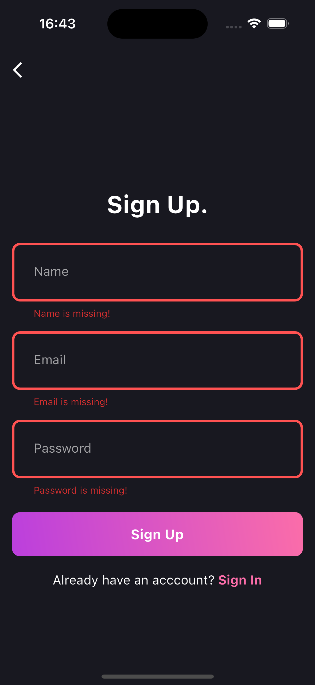
    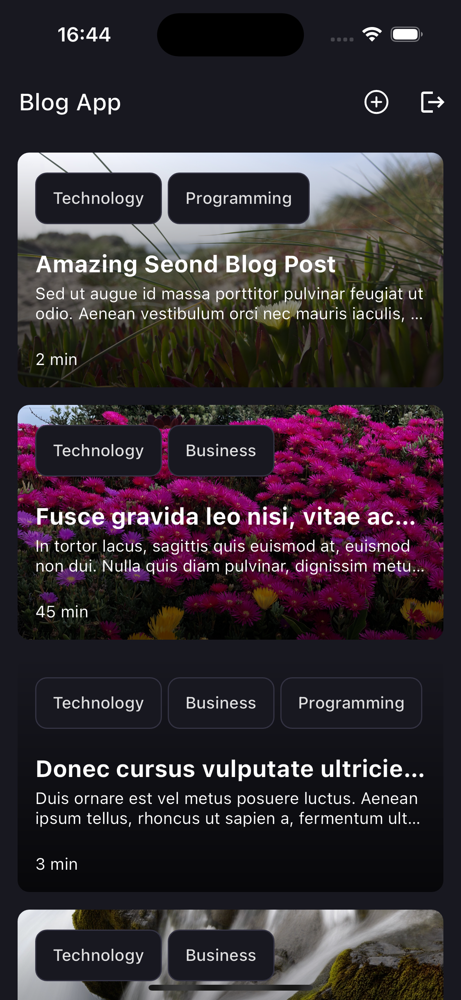
    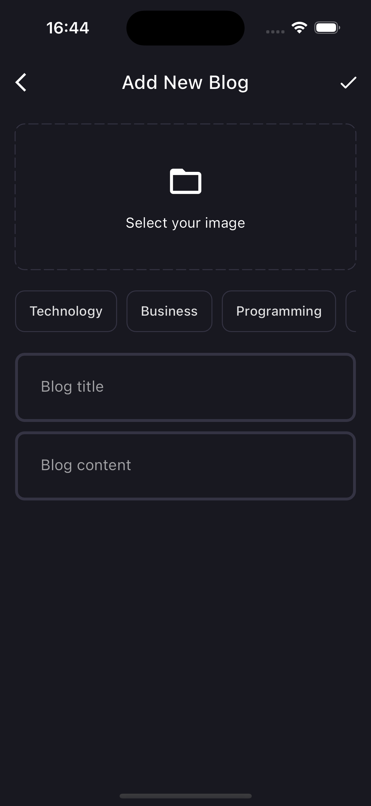
    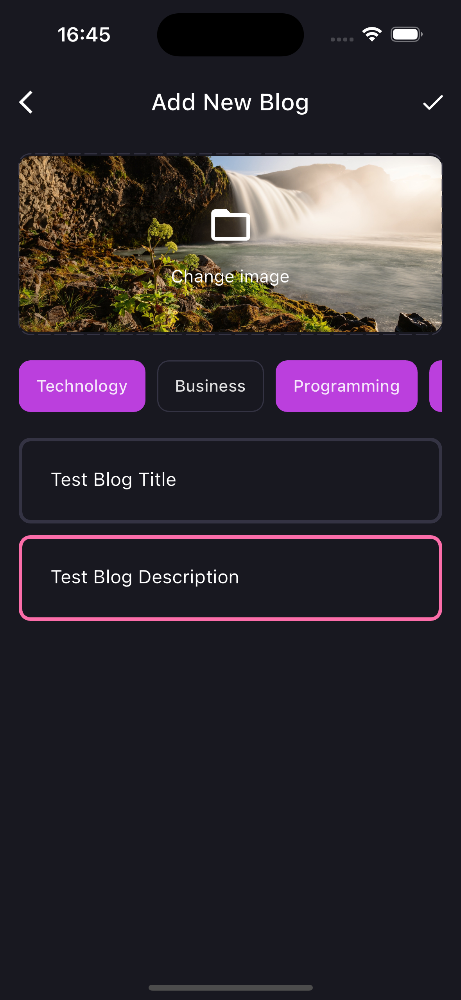
    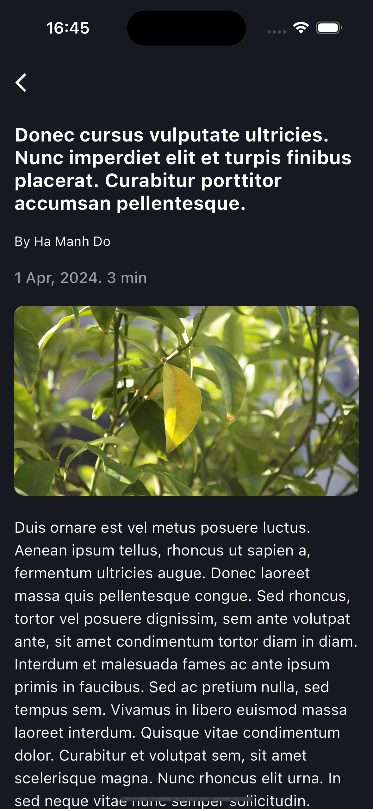

### Spotify Clone
[Build Spotify With Flutter - Bloc , Clean Architecture , Firebase , Figma](https://www.youtube.com/watch?v=4TFbXepOjLI)
> /spotify

#### Screenshots

    
    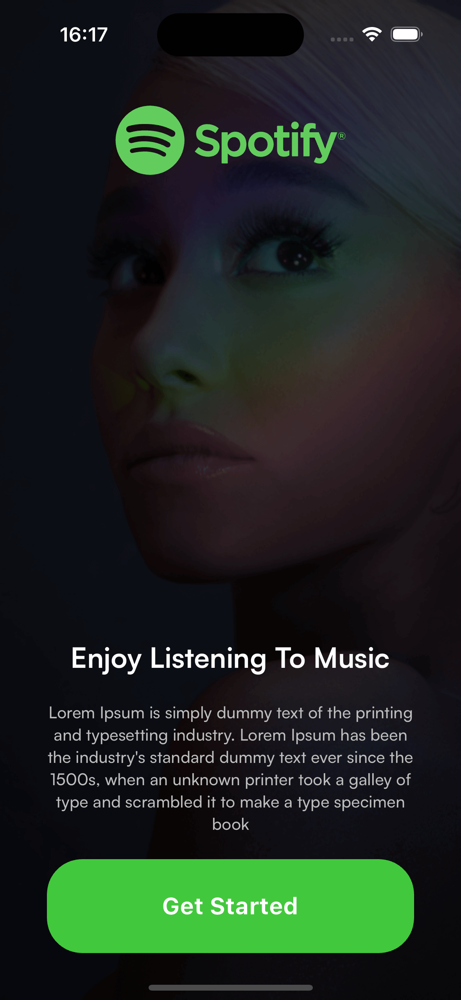
    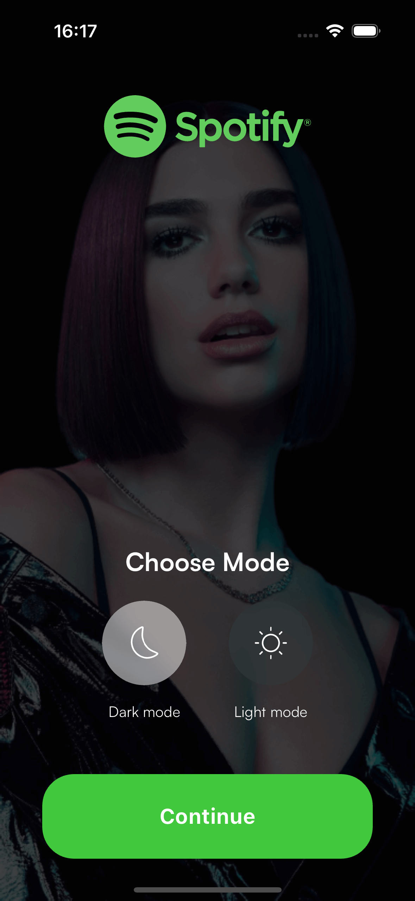
    
    
    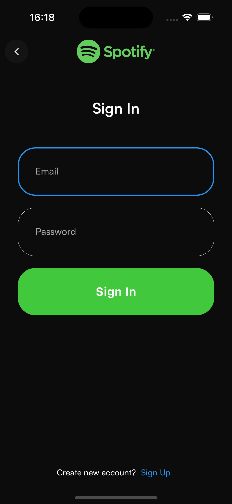
    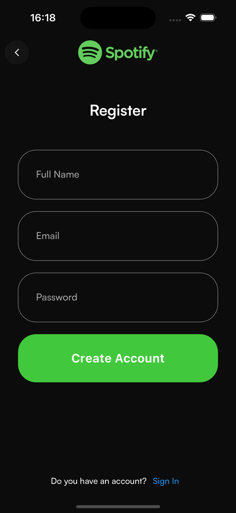
    
    
    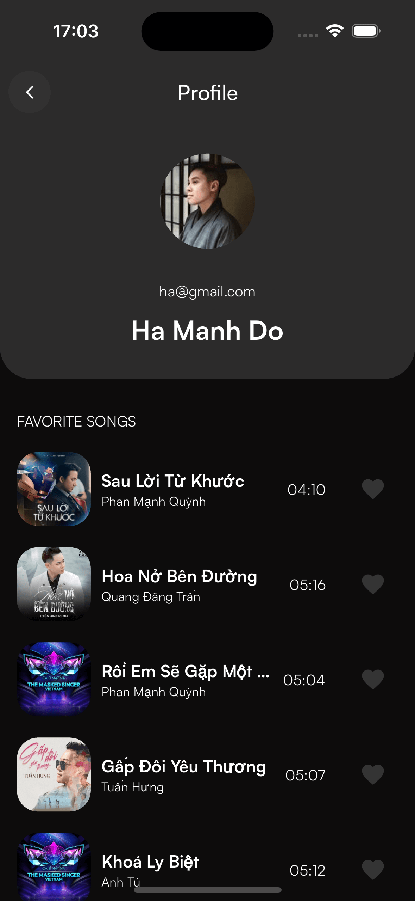

